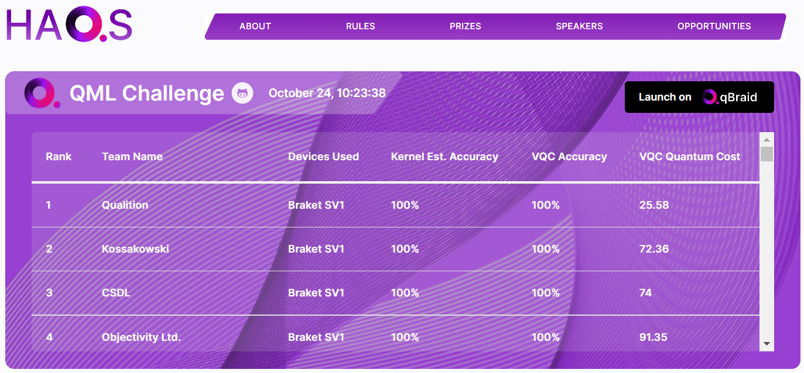

# HAQS-2022

 &nbsp; &nbsp; 

Repository contains submissions prepared by team "Kossakowski" for the [qBraid HAQS 2022](https://qbraid.com/haqs) quantum computing hackathon (Oct 21st - Nov 5th 2022).

Team "Kossakowski" in [qBraid HAQS 2022](https://qbraid.com/haqs) hackathon has taken:
- 1st place in [qBraid Open Challenge](qbraid-open-challenge/README.md)
- 3rd place in [QML Classifier Challenge](qml-classifier-challenge/README.md) (2nd on the leaderboard)

**Quantum cost** - approximates how expensive it would be to train VQC model on an actual gate-based QPU and is calculated as follows:
- Task Charges = iterations x batch size x ($0.30 / task)
- Shots Charges = iterations x batch size x shots x ($0.00035 / shot)
- Quantum Cost = Task Charges + Shots Charges

### Team Kossakowski

- [Bartosz Tomsia](https://github.com/bart-q)
- [Katarzyna Nałęcz-Charkiewicz](https://www.researchgate.net/profile/Katarzyna-Nalecz-Charkiewicz)
- [Paweł Góra](https://www.mimuw.edu.pl/~pawelg/indexpl.html)

### Other solutions

The solutions of other VQC Challenge and QML Overall Challenge winners can be found here:
- [CSDL](https://github.com/yh08037/HAQS-2022/tree/CSDL/qml-classifier-challenge) - 1st place in QML Overall Challenge
- [Qualition](https://github.com/JohnGoldenGardiner/HAQS-2022/tree/Qualition) - 2nd place in QML Overall Challenge and 1st place in QML Classifier Challenge
- [POIG](https://github.com/poig/HAQS-2022) - 3rd place in QML Overall Challenge
- [Feynman-Prodigies](https://github.com/Rohit-IISc/HAQS-2022) - 2nd place in QML Classifier Challenge

### Running Jupyter Notebooks

1. Create qBraid account or sign in to https://account.qbraid.com/haqs
2. At the top of this `README` click the **Launch on qBraid** button to clone this repository and launch qBraid Lab.
3. From the **FILES** tab in the left sidebar, double-click on the `HAQS-2022` directory and in subfolder double-click `.ipynb`  notebook to run.
4. You can also run VQC notebooks on myBinder by clicking  (Note: open challenge notebook requires additional modules available on qBraid only)

### Contact

For other questions or additional help using qBraid, see [Lab User Guide](https://qbraid-qbraid.readthedocs-hosted.com/en/latest/lab/overview.html), or reach out on [Discord](https://discord.gg/gwBebaBZZX).